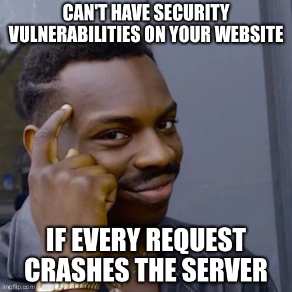

# Issue Summary
* Duration: Febrauary 14th, 2024. 1:00 AM - 5:30 AM (GMT+1)
* Impact: Complete unavailablity of checker one of the key components of ALX site, students were unable to verify the their project tasks, access their API advanced project, site gave error 500 sometime when tried accessing it, sandboxes were unavailable, this affected 100 % of the students
* Root Cause: API Advanced Project when the server tries a GET method to supply the assets of it's page, rendered the site inaccessible and generated a DOS failure
# Timeline
* 1:00 AM: The issue started
* 1:02 AM: Alerts trigget notification to the on-call operations team
* 1:05 AM: Engineers investigate the issue
* 1:25 AM: still investigating the issue and pinpointed the issue with API advanced project
* 1:50 AM: while giving themselves more time to investigate they configured a redirect of the requested page to a custom error page to inform the users that issue is being worked on
* 2:45 AM: Issue could not be found, a previous image of the page was restored
* 2:59 AM: Started testing if the restored page generated the same issue
* 3:05 AM: Started steadily launching the page to students
* 5:30 AM: reached 100% redployement of all features of ALX site
# Root Cause and Resolution

* N/A
# Corrective and Preventive Measures
* Make sure that a routine test is conducted before the launch of a new project before official launch date